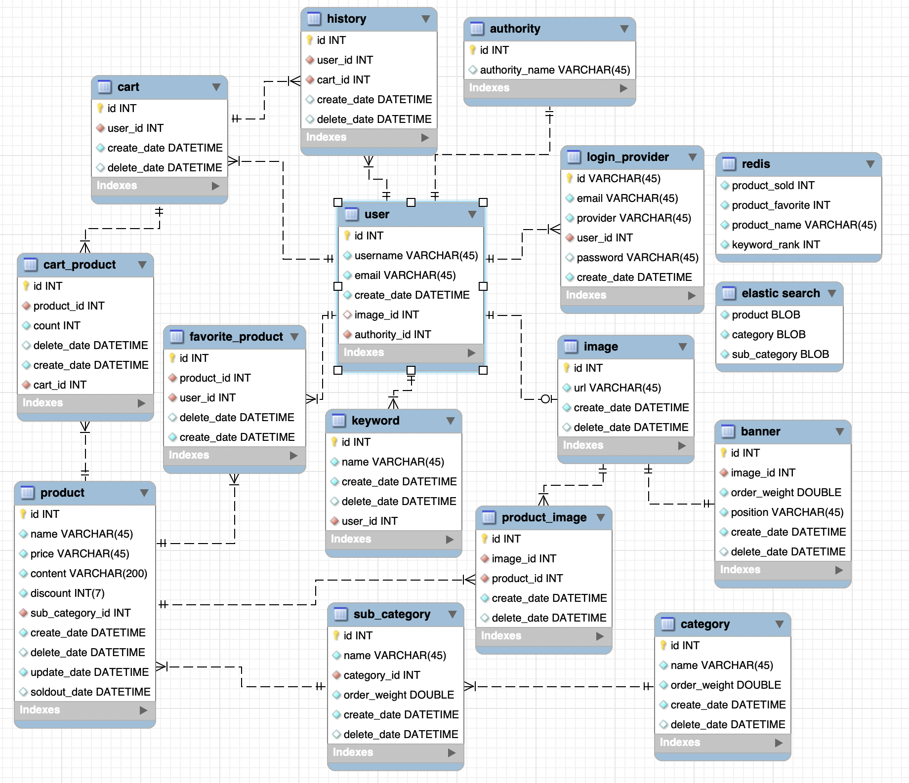

# Bmart Team 5

모바일 B마트 5팀 - 김명성, 이종구, 추연호

## 기술 스택


## 서비스 배포 링크

<div>
<a href="http://ec2-3-34-186-227.ap-northeast-2.compute.amazonaws.com/" target="_blank">

</a>
</div>

## 팀 협업 노션

<div>
<a href="https://www.notion.so/younho9/bmart-5-4ae7d73c4fba4805a1e30fd0c947fe54" target="_blank">

</a>
</div>

## Bmart 목업

<div>
<a href="https://xd.adobe.com/view/22fb035e-6f8c-49cb-72cd-88c8c8bb15a1-54ca/" target="_blank">

</a>
</div>

## API Document

<div>
<a href="https://documenter.getpostman.com/view/2322914/T1LPC6xM?version=latest" target="_blank">

</a>
</div>

## Quick Start

### Installation

#### 환경 구축

```
Ubuntu Server v18.04 LTS (HVM)
node v14.8.0
mysql v8.0.21
yarn v1.22.4
pm2 v4.4.1
```

#### 코드 빌드

```
git clone https://github.com/woowa-techcamp-2020/bmart-5.git
cd bmart-5
yarn install:all
yarn client-build
```

#### ENV 설정

**[shared/.env.sample](https://github.com/woowa-techcamp-2020/bmart-5/blob/develop/shared/.env.sample) 파일을 참고하여 shared/.env 파일을 생성해주시기 바랍니다.**

- 각 옵션에 대한 가이드입니다.

```
PORT : api server를 실행 시킬 포트
DEV_DB : development 환경에서 연결할 데이터베이스 이름
PROD_DB : production 환경에서 연결할 데이터베이스 이름
DB_USER : 두 데이터베이스에 대해 권한을 가지고 있는 mysql user
DB_PW : mysql user의 패스워드
JWT_SECRET : jwt 토큰의 secret 키
GOOGLE_CLIENT_ID : Google Console Api에서 발급받은 client id
GOOGLE_CLIENT_SECRET : Google Console Api에서 발급받은 client secret 키
GOOGLE_CALLBACK : Google Console Api에 등록한 구글 로그인시 callback url
MIGRATE : 서버 시작 시 데이터베이스 테이블 드랍, 초기화 유무 (false시 드랍, 초기화)
API_END_POINT : 클라이언트가 요청할 서버의 API 엔드포인트 url
```

> [Google Console Api](https://console.developers.google.com/)

#### 서비스 실행

- pm2, development

```
yarn start:dev
```

- pm2, production

```
yarn start:all
```

- pm2 없이 실행시키기

```
cd server
yarn dev
cd ../client
yarn dev
```

## 데이터베이스 ERD


